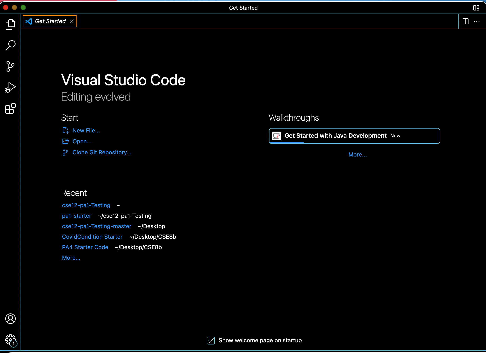
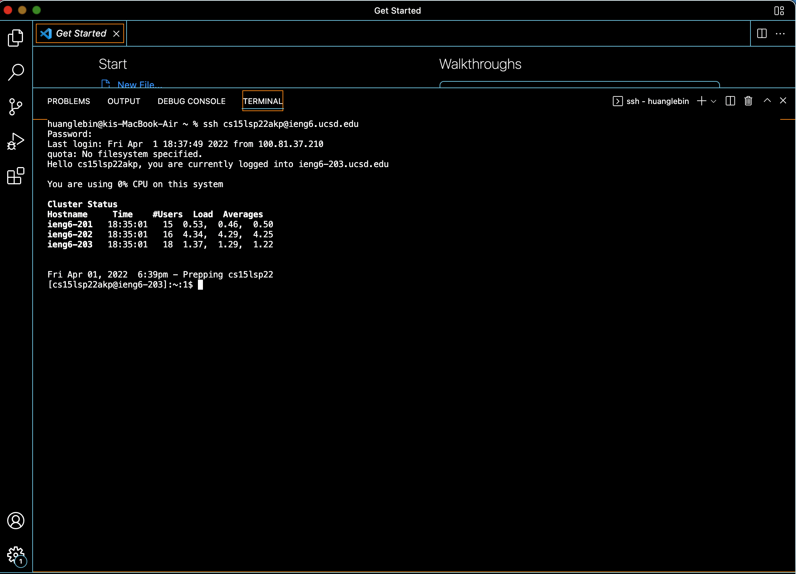
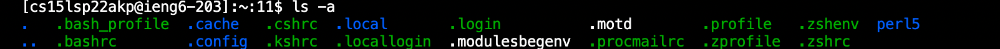
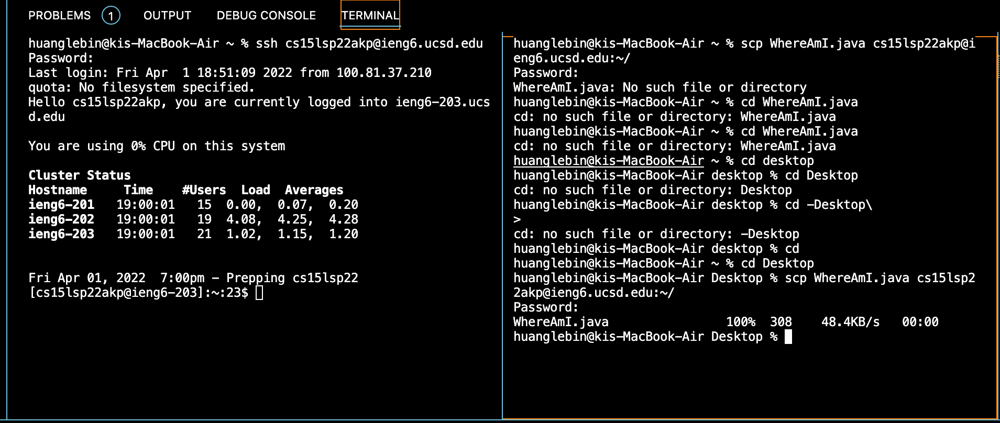
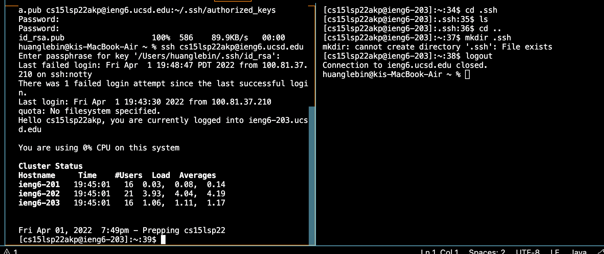
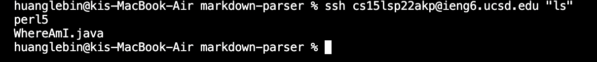
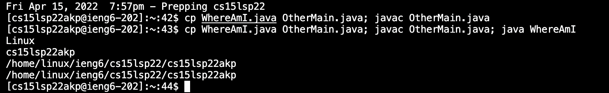

# Lab report Week 1

* ##Installing VScode  
* [vscode](https://code.visualstudio.com/)


I searched vscode on google. Then I downloaded the app.

* ##Remotely Connecting 
* [Install OpenSSH](https://docs.microsoft.com/en-us/windows-server/administration/openssh/openssh_install_firstuse) 
* [https://sdacs.ucsd.edu/~icc/index.php](https://sdacs.ucsd.edu/~icc/index.php) 
* [Connect to a remote host](https://code.visualstudio.com/docs/remote/ssh#_connect-to-a-remote-host)  
* [Ben Voigt’s answer](https://superuser.com/questions/421074/ssh-the-authenticity-of-host-host-cant-be-established/421084#421084)



I opened terminal in vscode. Then I remote connect by the command ```ssh cs15lsp22akp@ieng6.ucsd.edu```

* ##Trying Some Commands


I tried a couple different basic commands after I connected successfully. I used ```ls -a``` command to enlist the whole list of the current directory including the hidden files.

* ##Moving file with scp


First of all, I used cd to add the WhereAmI to the directory. And then I can use scp command to move my file to the server.

* ##Setting an SSH key 
* [ssh-add](https://docs.microsoft.com/en-us/windows-server/administration/openssh/openssh_keymanagement#user-key-generation)



I used a command called ```ssh keygen```. It could help me create a public key and private key. Since I finished, I could use the key to log in the sever.

* ##Optimizing Remote Running





Since I finished setting my SSh key, I can log in to the server without my original password. And I can do a lot of commands more effiency. 
