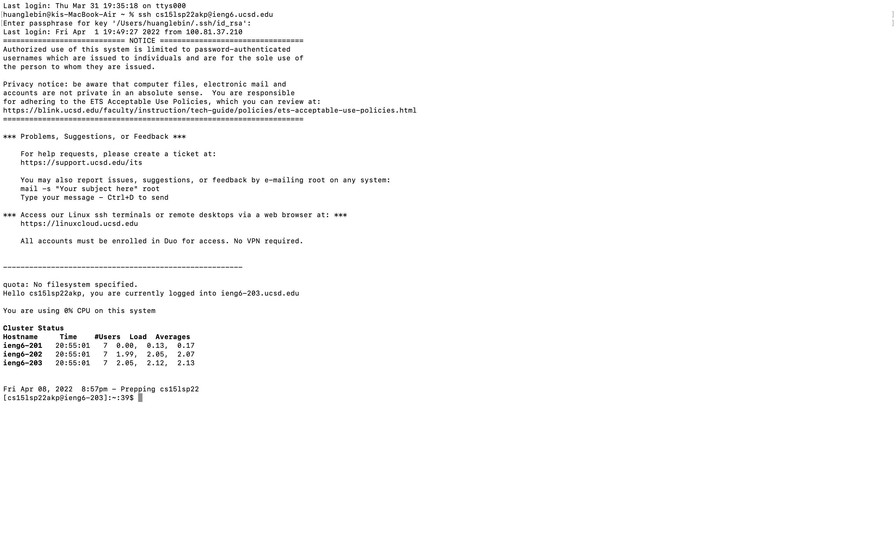

# Lab report Week 1

* Installing VScode

I searched vscode on google. Then I downloaded the app.

* Remotely Connecting

I opened terminal in vscode. Then I remote connect by the command "ssh cs15lsp22akp@ieng6.ucsd.edu"

* Trying Some Commands

I tried a couple different basic commands after I connected successfully. I used "ls -a" command to enlist the whole list of the current directory including the hidden files.

* Moving file with scp

First of all, I used cd to add the WhereAmI to the directory. And then I can use scp command to move my file to the server.

*Setting an SSH key

I used a command called "ssh keygen". It could help me create a public key and private key. Since I finished, I could use the key to log in the sever.

*Optimizing Remote Running

Since I finished setting my SSh key, I can log in to the server without my original password. I can use my passphrase to log in with it.