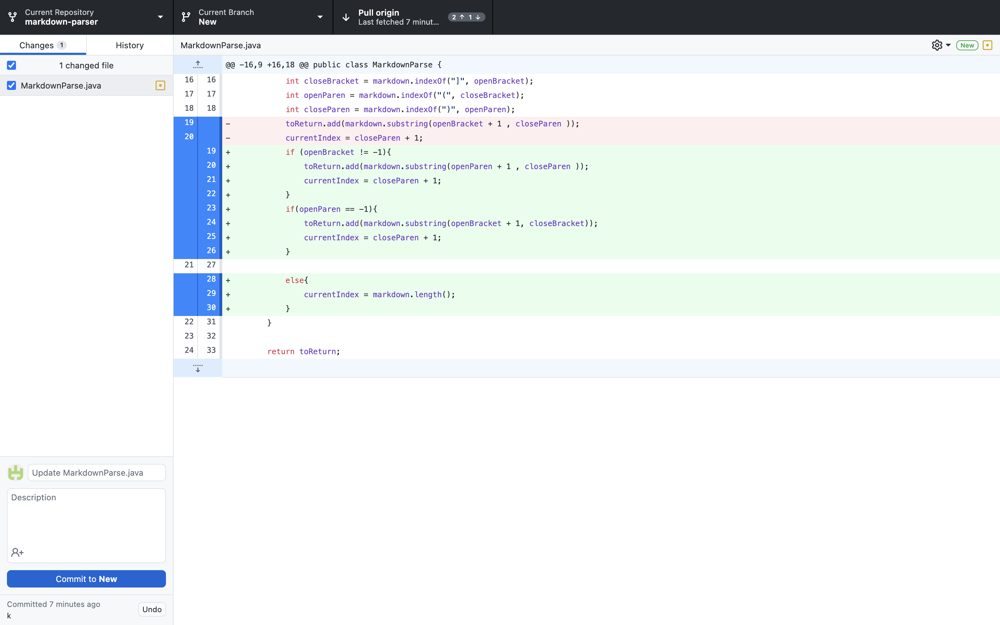
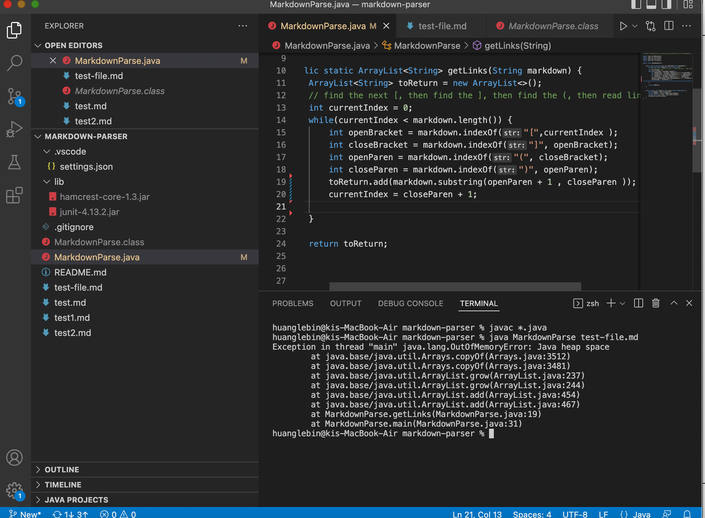
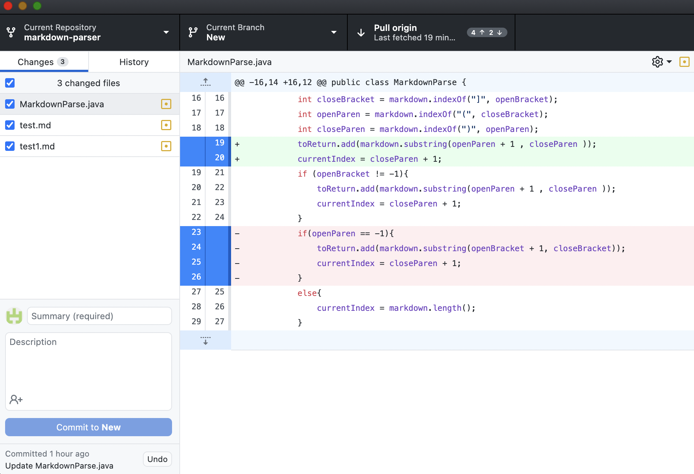
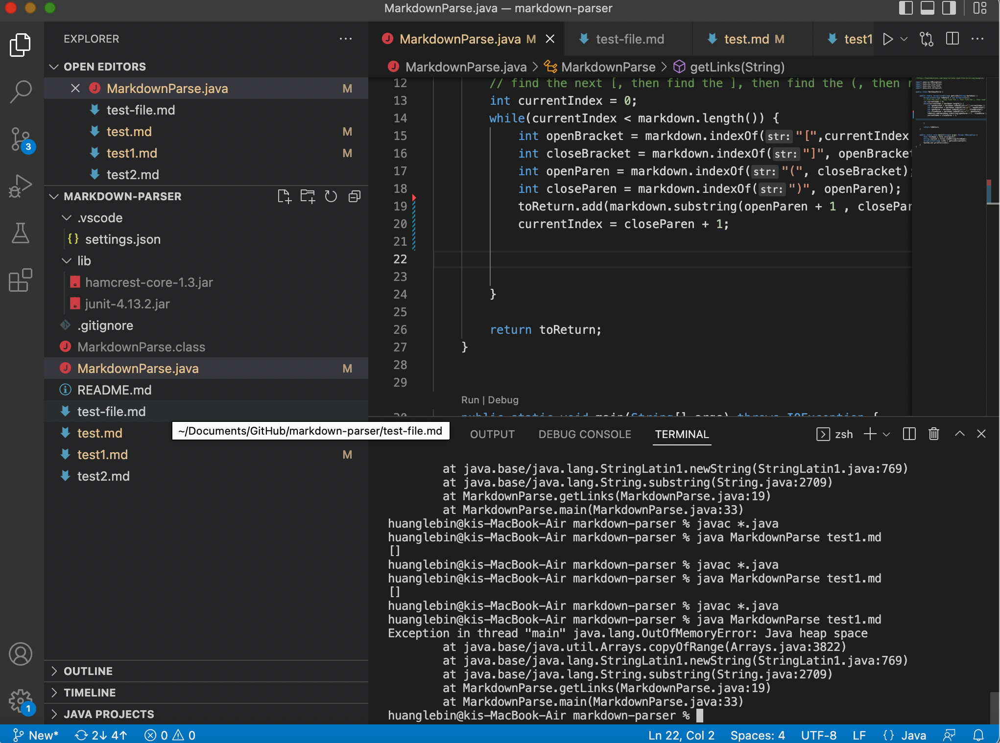
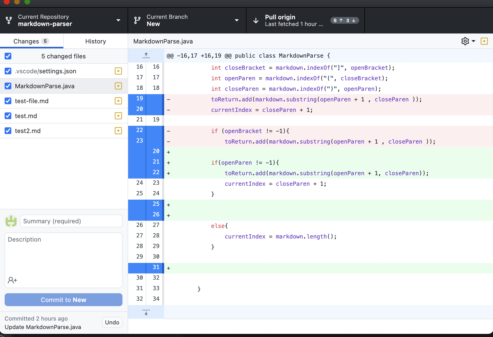
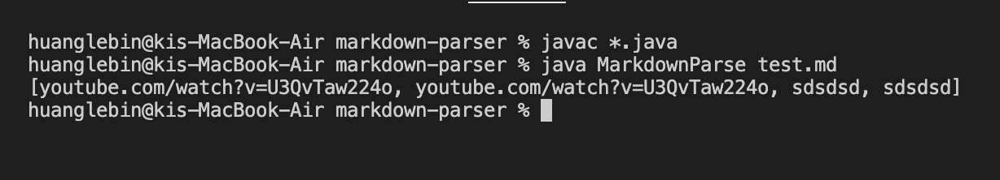

# lab-report-1-week-2.md
## 1
* 
* [Test file](https://github.com/LebinHuang/markdown-parser/blob/New/test-file.md)

* 

* Because I deleted a bracket for the second link of my input file, it will cause the openParen start with -1. And it lead to the output become out of memory.

## 2

* 
* [Test file](https://github.com/LebinHuang/markdown-parser/blob/New/test1.md)

* 

* Because I changed all bracket to paranthesis, it will cause the openbracket become negative 1. And the ```indexof``` method didn't accept negative number, it will go into dead loop and cause the output become out fo memory.

## 3

* 
* [Test file](https://github.com/LebinHuang/markdown-parser/blob/New/test.md)

* 

*  I spart two link very far in this file. And it cause me cannot call the ```add``` method to many times. Because it satisfy all the conditions, if I call the ```add``` method too many times, it will duplicate the list more than one time.