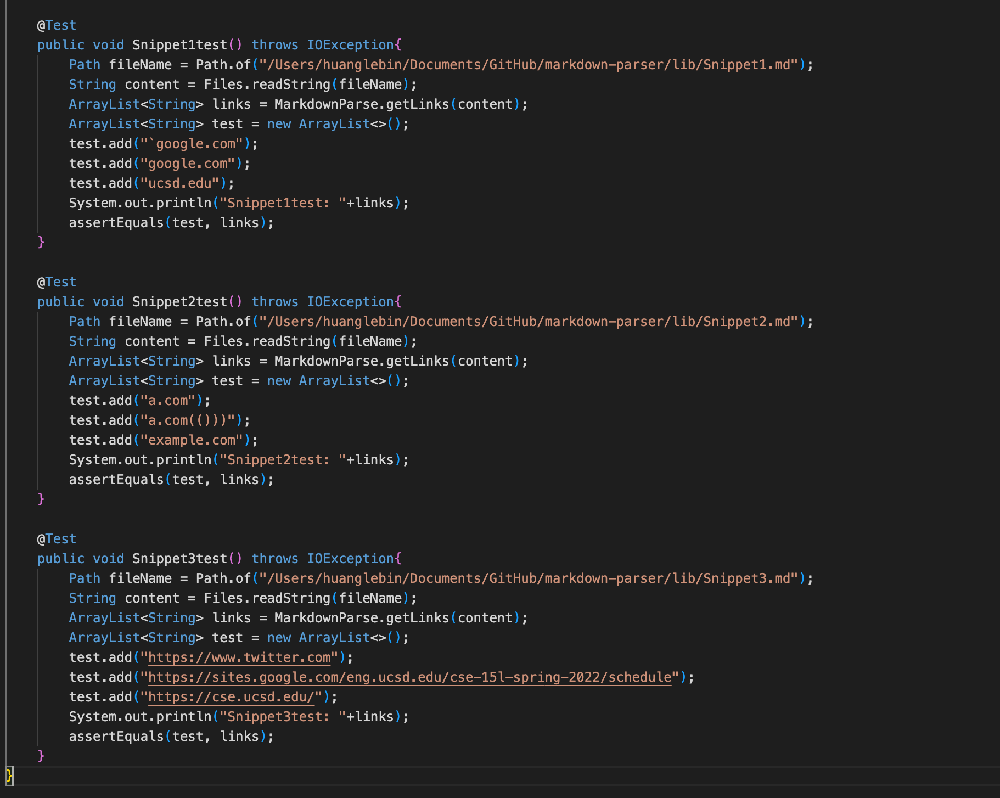
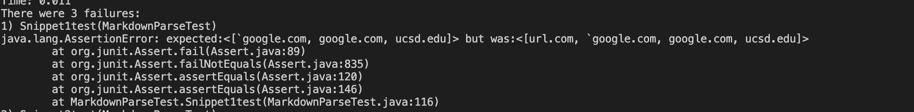
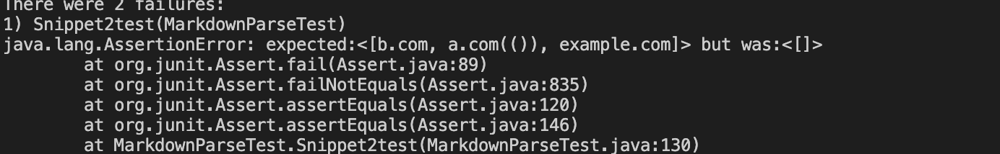
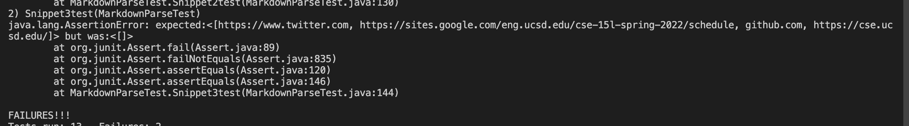
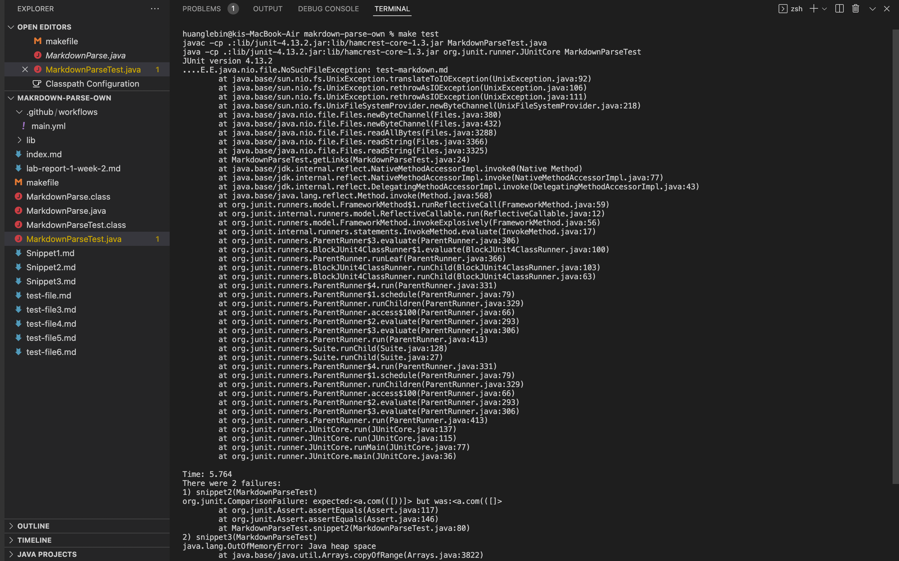
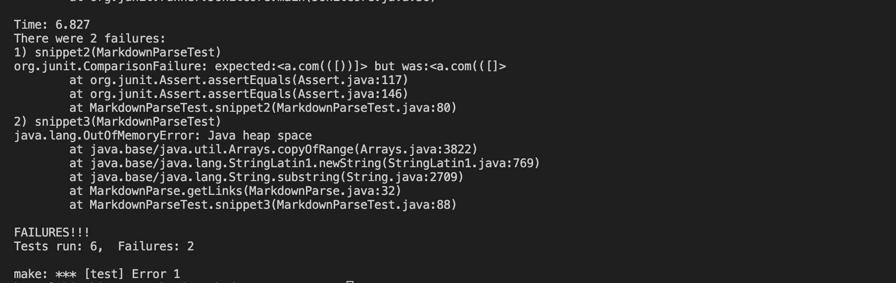
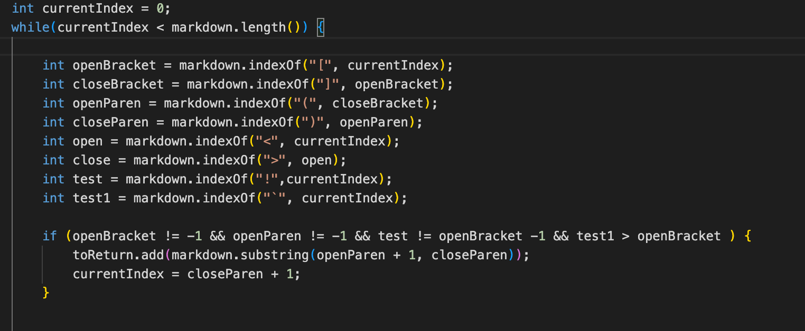

# lab-report-4-week-8

## Link
[Mylink](https://github.com/LebinHuang/markdown-parser)

[The one I reviewed](https://github.com/FishInAZ/makrdown-parse.git)

## Expected output

* Snippet1:


* Snippet2:


* Snippet3:


## Showing the code in MarkdownParseTest.java for how you turned it into a test

* 

## My implementation test

* Snippet 1 not passed



* Snippet 2 not passed



* Snippet 3 not passed



## The implementation I reviewed 

* Snippet 1 test pass

But for some reasons, the junit didn't give the output. Here is what I have for the test.



* Snippet 2 & 3 not pass



## Answer the questions

* Question 1:

I think a small code change will make my program work.
For the snippet1, what I did is to create a new integer call ```test1```. It will check where
the backticks are. And the add one more condition to the if statement. If the index of backtick bigger than the openBracket, we can add the link. Else, we cannot the link the array.

* Question 2:
I think a small code change will make my program work for snippet 2 and all related cases that nest parentheses, brackets, and escaped brackets. Because only problem of the snippet 2 is the nest parentheses and brackets. So I need to check whether the ```closebracket > openParen``` If the closebracket bigger than the openParen, it means we have a nested parentheses and we cannot add the link. Else, we can do ```toreturn.add(markdwon.substring(openParen + 1, close paren))``` to add the link at the last. If we have a nest bracket, we can check whether the ````closebracket and closebrack +1 have the same element ``` if they did equal, then closebracket will become closebracket + 1. And then I can add the link.

* Question 3
I think a small code change will not make my program work for snippet 3 and all related cases that have newlines in brackets and parentheses. Because this case is more complicated than previous. It has newlines in brackets and parentheses and it has nest bracket and nest parenthesis inside a parenthesis. So I don't think a small code change can handle this case.