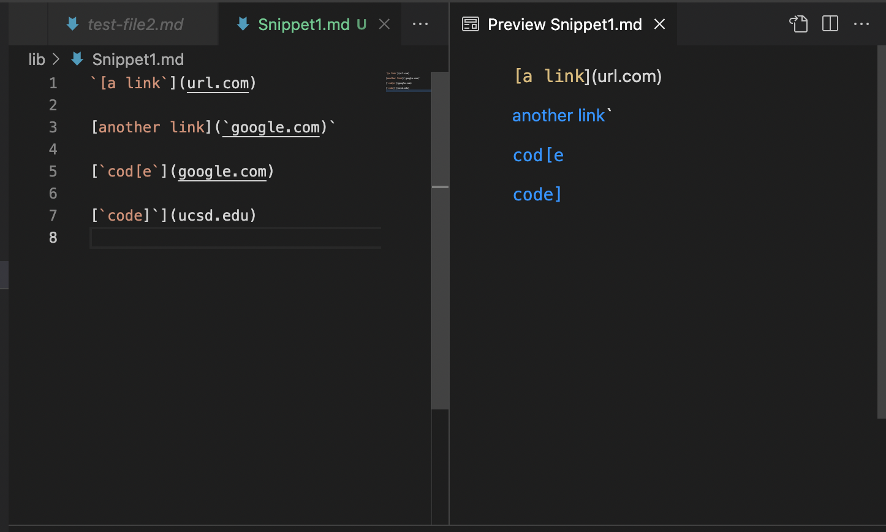
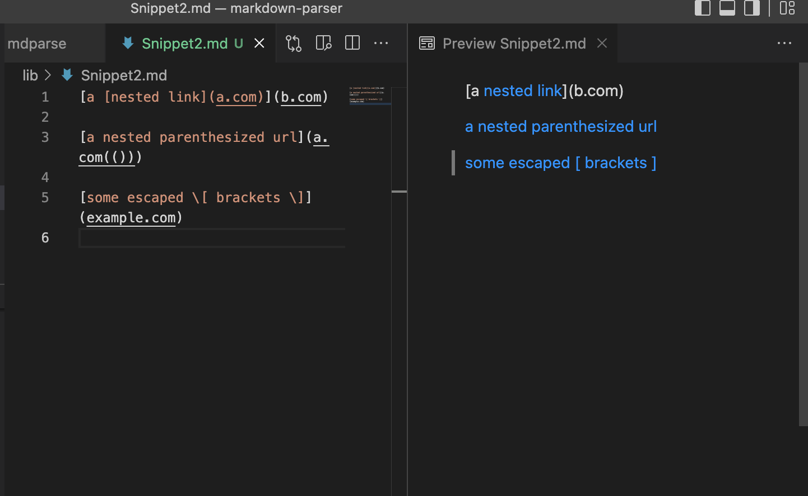
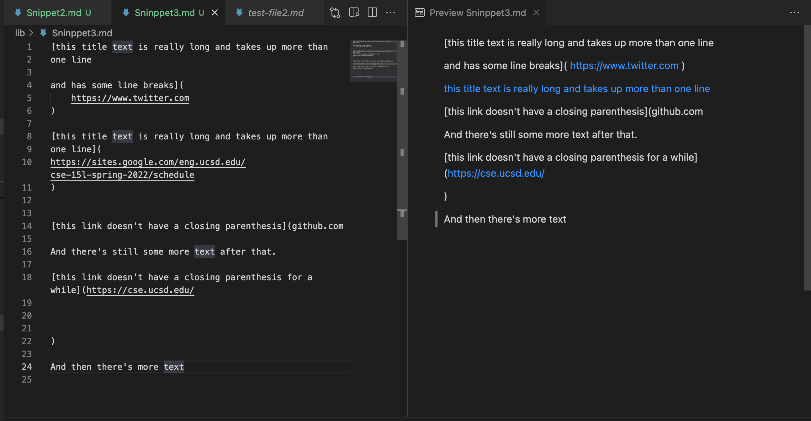
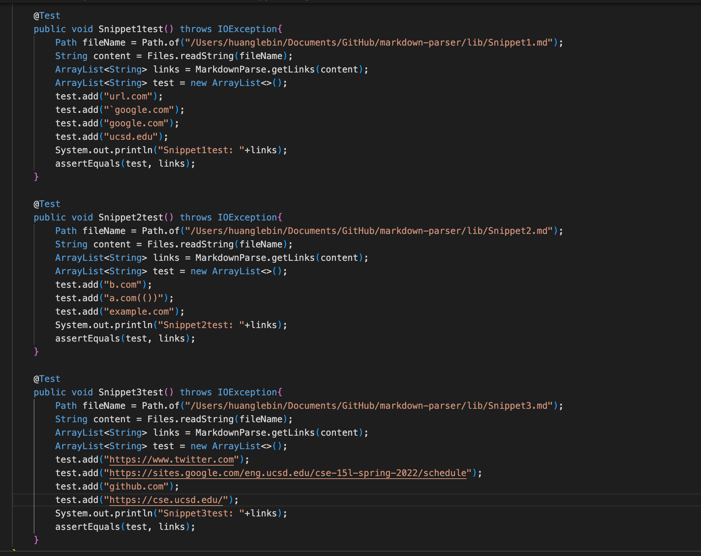
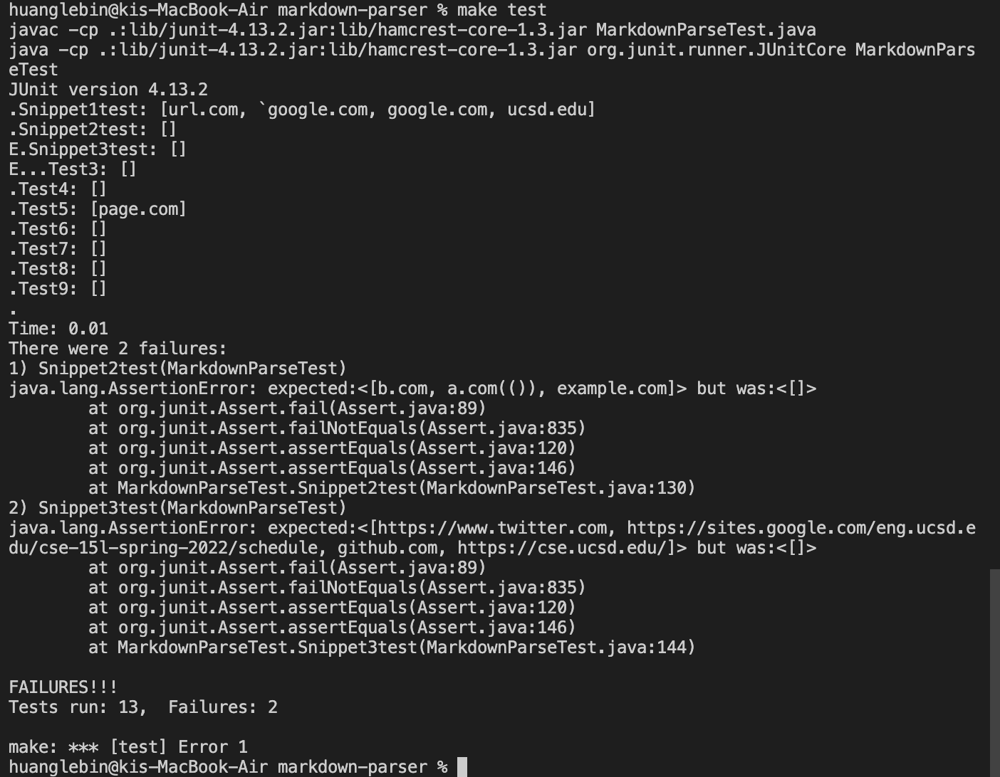
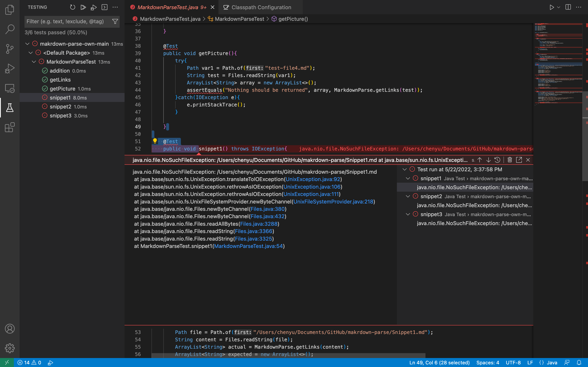
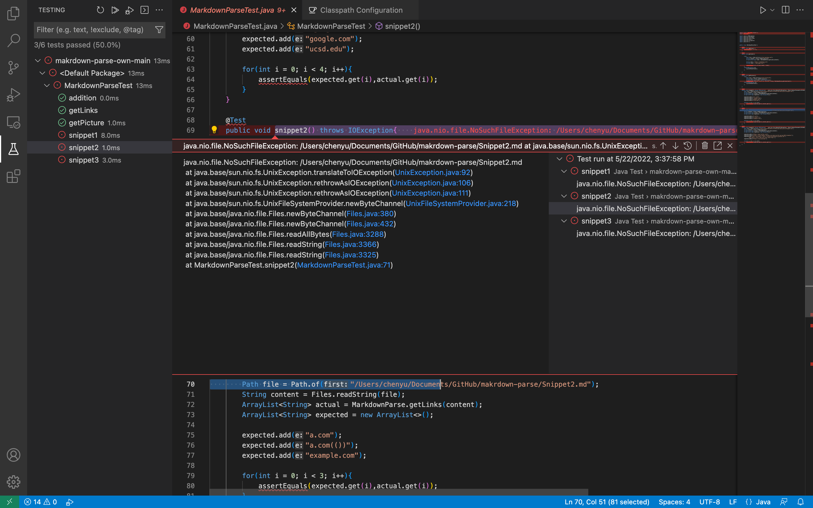
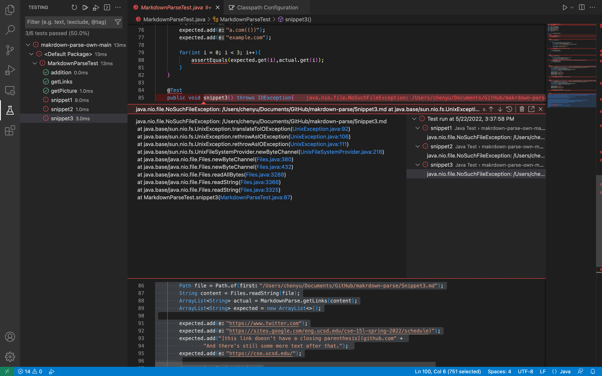

# lab-report-4-week-8

## Link
[Mylink](https://github.com/LebinHuang/markdown-parser)

[The one I reviewed](https://github.com/FishInAZ/makrdown-parse.git)

## Expected output

* Snippet1:



* Snippet2:



* Snippet3:



## Showing the code in MarkdownParseTest.java for how you turned it into a test

* 

## My implementation test

* Snippet 1 passed
* Snippet 2 & 3 not passed

* 

## The implementation I reviewed 

* Snippet 1 test



* Snippet 2 test



* Snippet 3 test 



## Answer the questions

* Question 1:
For the snippet1, I checked whether the openbracket == -1 and the close == -1. If they both not equals to -1, it would be a valid link and I can add it to my arraylist.

* Question 2:
I think a small code change will make my program work for snippet 2 and all related cases that nest parentheses, brackets, and escaped brackets. Because only problem of the snippet 2 is the nest parentheses and brackets. So I need to check whether the closebracket == -1 and the openParen == -1. If they both not equals to -1, then I can do ```toreturn.add(markdwon.substring(openParen + 1, close paren))``` to add the link at the last.

* Question 3
I think a small code change will not make my program work for snippet 3 and all related cases that have newlines in brackets and parentheses. Because this case is more complicated than previous. It has newlines in brackets and parentheses and it has nest bracket and nest parenthesis inside a parenthesis. So I don't think a small code change can handle this case.