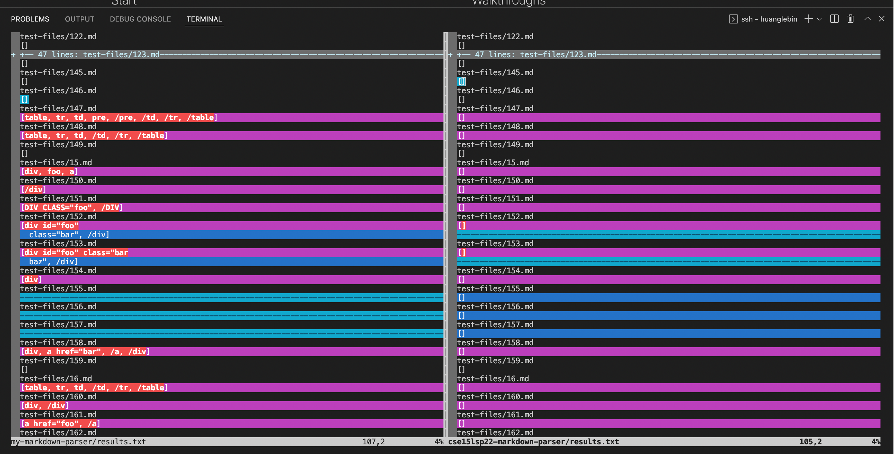
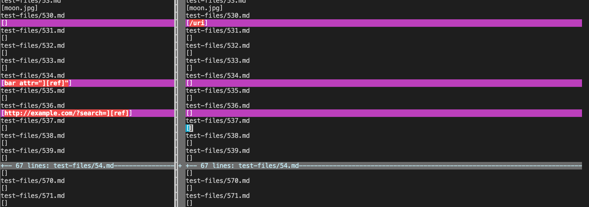
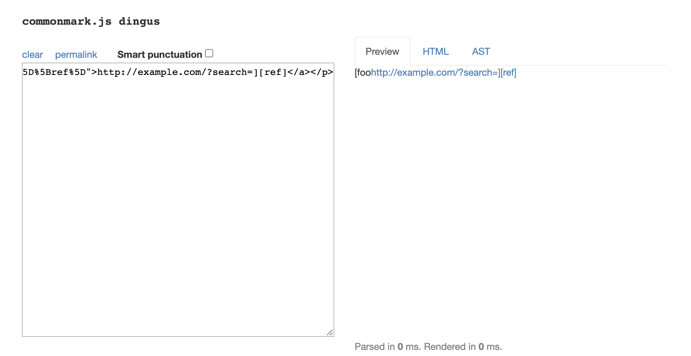
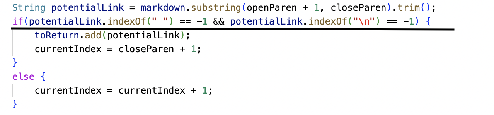
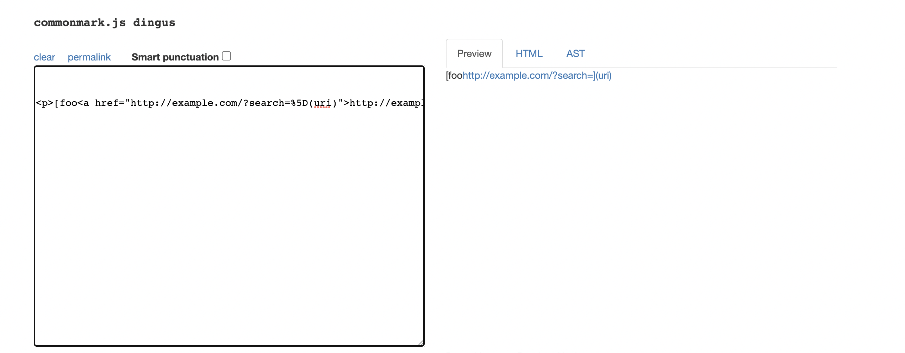
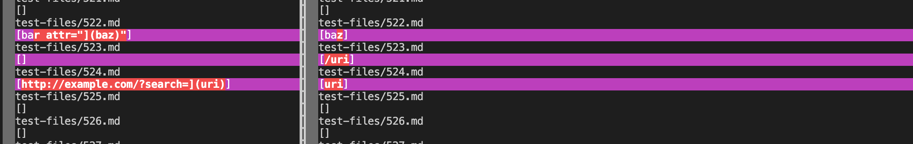

# lab-report-5-week-8

## How you found the tests with different results

* I found the tests with different results by use vimdiff.

* Provide a link to the test-file with different-results

[Link 1](https://github.com/nidhidhamnani/markdown-parser/blob/main/test-files/537.html.test)

[Link 2](https://github.com/nidhidhamnani/markdown-parser/blob/main/test-files/525.html.test)

# For one test:

## Describe which implementation is correct, or neither if both give the wrong output

For the first link, my implemention is correct

## Actual output:

## Expected output: 

## Describe the bug
For the given code, it only check the closeparen position. Therefore, it didn't add anything to the list.

# For second test:

## Describe which implementation is correct, or neither if both give the wrong output

For the second link, my implementation is correct.

* Actual output:

* Expected output:

## Describe the bug
For the given code, it only check the closeparen position. Therefore, it only add uri to the list.

